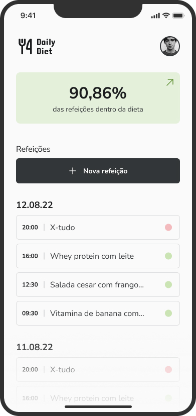
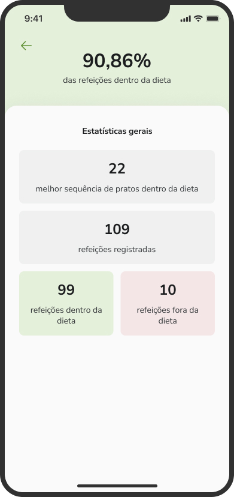
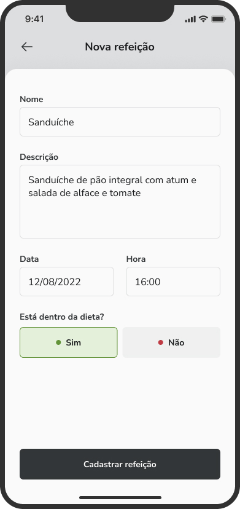
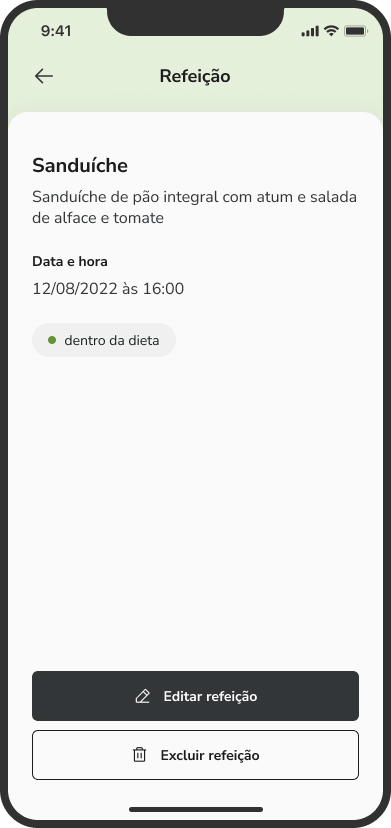
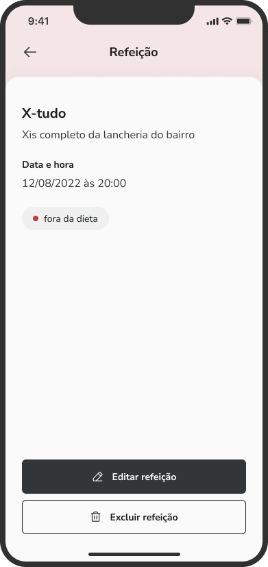

# Ignite Daily Diet

A mobile application developed with React Native and Expo that allows users to manage their daily diet by adding, editing, and deleting meals. The app also provides statistics such as the number of meals in the diet, the number of meals out of the diet, and the percentage of meals inside the diet.

## Table of Contents

- [Features](#features)
- [Requirements](#requirements)
- [Installation](#installation)
- [Usage](#usage)
- [Screenshots](#screenshots)
- [Technologies](#technologies)
- [License](#license)

## Features

- Add, edit, and delete meals
- View statistics such as the number of meals in the diet, the number of meals out of the diet, and the percentage of meals inside the diet
- Track the best sequence of meals without breaking the diet

## Requirements

- [Node.js](https://nodejs.org/) (v14 or higher)
- [Expo CLI](https://docs.expo.dev/workflow/expo-cli/) (v4 or higher)

## Installation

1. Clone this repository

2. `cd ignite-daily-diet` in your terminal

3. Run `npm install` to install dependencies.

## Usage

1. Start the app `expo start`

2. Use your mobile device to scan the QR code displayed in the terminal or in the Expo Dev Tools.

3. The app should now be running on your device.

## Screenshots

Here are some screenshots of the project:

    
Click to view images

    <h2>Home</h2>
    
    <h2 style="margin-top: 50px">List Screen</h2>
    
    <h2 style="margin-top: 50px">Create Meal </h2>
    
    <h2 style="margin-top: 50px">Edit Meal </h2>
    
    <h2 style="margin-top: 50px">Meal on Diet </h2>
    
    <h2 style="margin-top: 50px">Meal out of Diet </h2>
    

## Technologies

- React Native
- Expo
- TypeScript
- React Navigation
- React Hook Form
- Yup
- Lodash
- Styled Components
- Phosphor Icons
- Async Storage

## Disclaimer

This project's design was provided by [@Rocketseat](https://github.com/Rocketseat) as part of the Ignite course.

By [Cristiano Alchaar da Silva](https://github.com/CristianoAlchaar)
